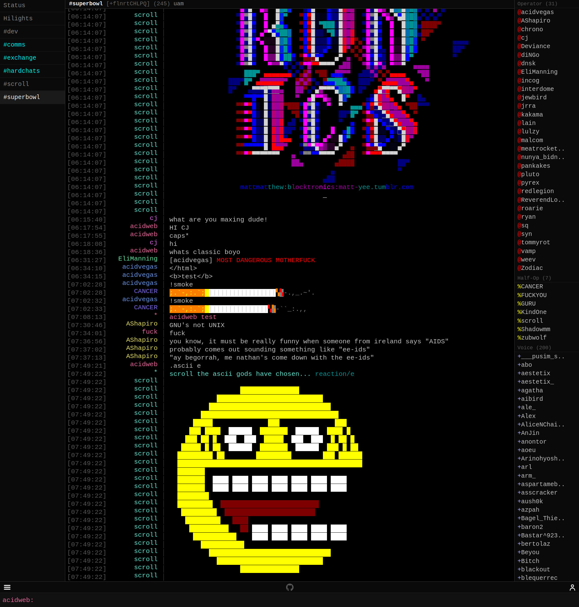

# SuperNETs IRC WebChat

A minimal client-side JavaScript IRC webchat interface.

**Live:** [https://webchat.supernets.org](https://webchat.supernets.org)

## Features
- Pure client-side JavaScript (no backend required)
- WebSocket IRC connection
- Auto-reconnection on disconnect
- Desktop notifications
- Mobile responsive

## Usage
Simply open `index.html` in a web browser or deploy to any static web host.

---

###### Mirrors: [SuperNETs](https://git.supernets.org/acidvegas/elastop) • [GitHub](https://github.com/acidvegas/elastop) • [GitLab](https://gitlab.com/acidvegas/elastop) • [Codeberg](https://codeberg.org/acidvegas/elastop)
